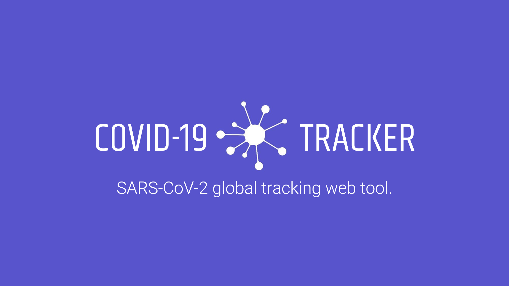

<h1 align="center">🦠 COVID-19 Smart Tracker 🔬</h1>

<p align="center">
    COVID-19 smart tracker powered by React library
</p>


<p align="center">
    <a href="https://nodejs.org/"></a>
    <a href="https://reactjs.org/"></a>
</p>

<p align="center">
    
    
</p>

## 🚀 Deployment
The deployment of this tool was done through [**Vercel**](https://vercel.com/).
You can check the deployment version [here](https://covid-19-smart-tracker.vercel.app/).

📦 Install the dependencies
```bash
npm install
```

## 🔨 Builded with
### Material UI
This package provides react components for faster and simpler web development.

### Leaflet
Leaflet is the leading open-source JavaScript library for mobile-friendly interactive maps. Weighing just about 39 KB of gzipped JS plus 4 KB of gzipped CSS code, it has all the mapping features most developers ever need.

### Numeral
A javascript library for formatting and manipulating numbers.

### React ChartJS
A react wrapper for [ChartJS.org](https://www.chartjs.org/docs/latest/).


## 🤲 Contributing
Do you would like to contribute? Do you want to be the author of a new feature? Awesome! please fork the repository and make changes as you like. [Pull requests](https://github.com/360macky/COVID19-Tracker/pulls) are warmly welcome.


## 📃 License
Distributed under the MIT License.
See [`LICENSE`](./LICENSE) for more information.
